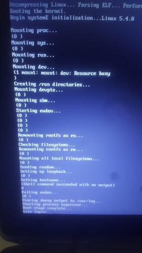

# systemE
A lightweight systemd replacement written in Emacs lisp

## About

Using the tooling in this repo, I am able to boot from linux to sinit as PID1, and from there to Emacs acting as PID2 using --script mode, performing all typical rc.boot system initialization using Emacs lisp until we hit the getty.

Additionally from the getty, I use Emacs as a login shell, dotfiles manager, package-manager front-end, startx / xinitrc replacement, and Window Manager. I have nearly purged shell scrips from my life entirely. For more information about these things, see my [.emacs repo](https://github.com/a-schaefers/dot-emacs).



## Status

- The rc.boot.el and rc.shutdown.el scripts are finished and I use them on my local machine. No support for fancy stuff like luks is planned.
- We still depend on [suckless "sinit"](https://core.suckless.org/sinit/) for PID1 (Emacs is PID2) and this needs to be rewritten in in a lisp. While **it is easy to execute Emacs as PID 1**, [as evidenced here](http://www.informatimago.com/linux/emacs-on-user-mode-linux.html), Emacs does not reap zombies and I do not know how to make it reap them yet. I have found Emacs listens for the URS1 and URS2 signals, but not SIGCHLD which is what we need. We also need to figure out how to call wait () after that. Also I really like sinit at this point, and am not in a hurry to swap it out.


- We still depend on busybox runit for a process supervisor and this needs to be reimplemented in elisp, or atleast converted to gnu shepherd. An Elisp service supervisor that could be communicated to using emacsclient as root would be really fun.

- One pain point is getting a statically compiled Emacs. We don't require this, but it sure would be nice. Unfortunately, when I statically compile Emacs using musl, it results in a broken Emacs.

## This repo is technically a [kiss linux](https://getkiss.org) package

Depends are:

- sinit
- ubase
- sbase
- dash
- emacs

The sinit package uses my [kiss-overlay](https://github.com/a-schaefers/kiss-overlay), which is on the front of my 'KISS_PATH'.

### The ever-growing list of Helpful / Credits / Thank You's

```elisp
;; https://github.com/kisslinux/init/blob/master/lib/init/rc.boot
;; https://github.com/kisslinux/init/blob/master/lib/init/rc.shutdown
;; https://gist.github.com/lunaryorn/91a7734a8c1d93a8d1b0d3f85fe18b1e
;; https://busybox.net/FAQ.html#job_control
;; https://stackoverflow.com/questions/23299314/finding-the-exit-code-of-a-shell-command-in-elisp
;; https://github.com/Sweets/hummingbird
;; https://felipec.wordpress.com/2013/11/04/init
;; https://www.emacswiki.org/emacs/PersistentProcesses
;; https://stackoverflow.com/questions/17479529/self-contained-portable-emacs
```
